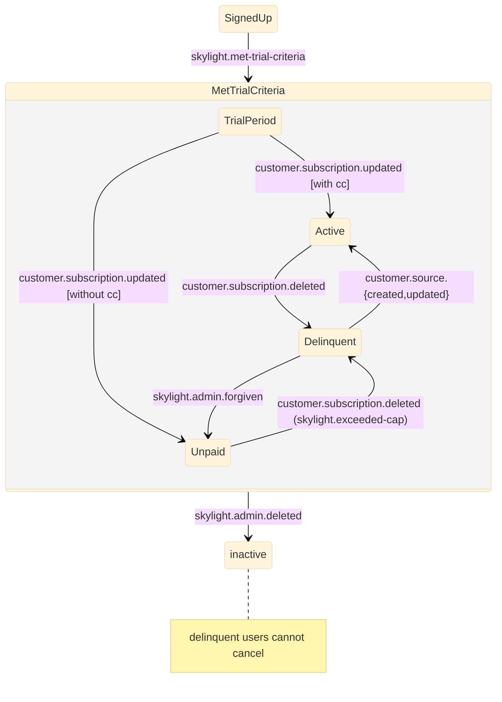

# State Machine

# Phase 1: Directly Track Organization State

1. Just Add It
   - add an org_state field
   - assert that it matches the current semantics
   - implement a method to recover the current state from other fields + stripe
2. Repeat: Use it for locking / auth
   - use org_state
   - background verify
3. Use it for cancellation (doesn't block Phase 1)
   - when cancellation occurs:
     - revalidate org_state
     - verify and notify <- prefer old implementation
4. Use it in the admin
   - warn unless it's active -> active

# Phase 2: In Parallel

## 1. Finish Simplifying Auth

1. Copy the org_state field into apps (or figure out a way to reliably index it)
2. If we don't index org_state, make sure to repair it when transferring an app
3. Clean up the code in agent_authorizer

## 2. Annotate Daily Usage Records

> This is mostly important for transfers. It also provides clarity around delinquency.

1. Design It
   - figure out what states a DUR can be in (~ trial, current, invoiced, delinquent, forgiven, ...)
2. Just Add It
   - add the field
   - when a DUR is added to a trial org, mark it as trial
   - when a DUR is added to an active org, mark it as current
   - when a DUR is part of an invoice, mark it as invoiced
   - when a customer becomes delinquent, mark all invoiced DURs as delinquent
3. Use the new states in the usage UI
   - decide whether to completely ignore DURs for the current usage or show transferred apps differently
4. Turn policy into reality: forgive DURs
   - when moving a customer to an inactive state, forgive all of their DURs
   - when allowing a delinquent customer to unlock by adding a credit card, forgive any
     DURs that we don't bill them for
5. Use it to bill less for transferred apps
   - don't bill customers for DURs that were marked as trial
   - don't bill customers for DURs that were marked as paid
   - consider forgiving DURs that were prior to the transfer date
     - otherwise, add a warning in the UI
     - when we automate transfers, if we don't forgive DURs, prominently make that clear
6. Firm up policy for forgiving DURs during transfers
7. Firm up other policies for forgiving DURs

# Phase 3: Automated Transfers

1. Consider the possibility that automated transfers are a symptom of a deeper issue with our
   billing model
1. Design the policy for how transfer affects DURs for all valid source -> target states
1. Design the UI
1. When an app is transferred,
